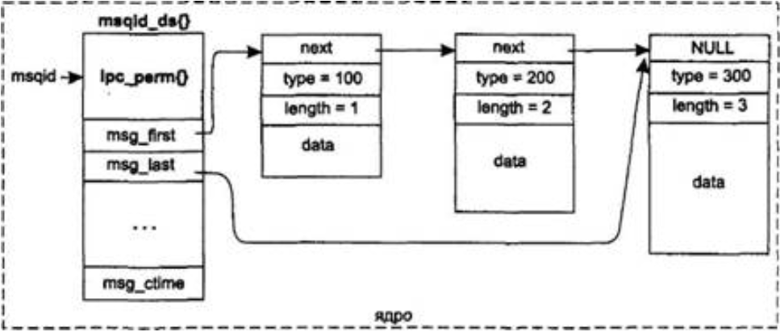

# Очередь сообщений System V
07/03/2026



## Лекция

### Атрибуты очереди сообщений

- Имя (целое число)
- UID, GID создания очереди
- UID, GID назначения владельца
- Права доступа к очереди сообщений
- Время и идентификатор процесса, который последний передал сообщение в очередь
- Время и идентификатор процесса, который последний прочитал сообщение
- Указатель на сообщение

### Сообщение

- Данные сообщения
- Тип сообщения

### Создание/получение доступа (открытие) очереди сообщений

```c
int msgget(key_t key, int flag)
// key - интерпретатор (имя) очереди сообщений
// flag - флаг
```

#### Флаги

- IPC_CREAT | IPC_EXCL - гарантированное создание новой очереди сообщений
- IPC_CREAT | 0777 - разрешить все

### Отправка (запись) сообщения в очередь

```c
int msgsnd(int msgfd, const void* msgPtr, int len, int flag)
// msgfd - целое число, которое получено от msgget
// msgPtr - указатель на переменную типа struct msgbuf
// len - длина в байтах поля mtext, на который указывает msgPtr

struct msgbuf
{
    long mtype; // тип сообщения
    char mtext[MSGMAX]; // сообщение
};
```

- IPC_NOWAIT - указание на то, что вызов не является блокирующим

### Получение (чтение) сообщения из очереди

```c
int msgrcv(int msgfd, void* msgPtr, int len, long mtype, int flag)
// msgfd - целое число, которое получено от msgget
// msgPtr - указатель на переменную типа struct msgbuf
// len - размер сообщения, которое хотим считать
// mtype - тип сообщения, которое хотим считать
// flag - флаги
```

Смысл `mtype`

- 0 - считать из очереди самое старое значение любого типа
- Положительное число - считать из очереди самое старое сообщение заданного типа
- Отрицательное число - считать из очереди сообщение, тип которого меньше абсолютного значения `mtype` или равен ему. Если таких сообщений несколько, то считать самое старое

### Управление очередью сообщений

```c
int msgctl(int msgfd, int cmd, struct msqid_ds* mbufPtr)
// msgfd - целое число, которое получено от msgget
// cmd - команда
// msqid_ds* mbufPtr - указатель на структуру с полями, которые описывают очередь
```

- IPC_STAT - получение атрибутов очереди
- IPC_SET - установление атрибутов очереди
- IPC_RMID - удаление очереди

```c
msgctl(msgfd, IPC_RMID, NULL); // удаление очереди сообщений
```

### Концепции работы с семафорами

```c
int semget(key_t key, int num_sem, int flag)
int semop(int semId, struct sembuf* pBuf, int len)

struct sembuf
{
    short sem_num;
    short sem_op;
    short sem_flag;
};
```

Флаг:

- SEM_UNDO

```c
int semctl(int semId, int num, int cmd, union semun arg)

union semun
{
    int val; // значение семафора
    struct semid_ds* buf; // управляющие параметры
    unsigned short* array; // массив значений семафора
};
```

- IPC_STAT - получение информации о работе семафоров
- IPC_SET - модификация управляющих параметров
- IPC_RMID - удаление наборов семафоров
- GETALL - получить текущее значение всех семафоров в наборе
- SETALL - установить все значения семафоров с помощью `arg.array`
- GETVAL - получить значение семафора с номером `num` (`arg` не используется)
- SETVAL - установить семафор с номером `num` в значение `arg.val`
- GETNCNT
- GETZCNT

### Концепции работы с разделяемой областью памяти

```c
int shmget(key_t key, int size, int flag)
void* shmat(int shmId, void* addr, int flag)
int shmdt(void* addr)
int shmctl(int shmId, int cmd, struct shmid_ds* buf)
```

- IPC_STAT
- IPC_SET
- IPC_RMID - удалить можно только неиспользуемую разделяемую память

## Интернет (очень похоже на лекцию)

[Подробный вариант лекции](https://parallel.uran.ru/book/export/html/505)
