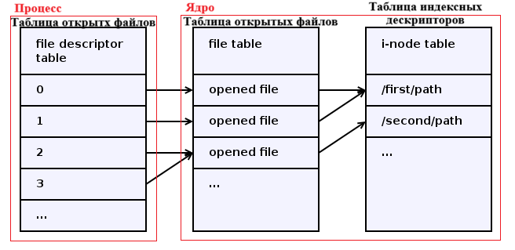

# Файлы. Файловая система (VFS - виртуальная файловая система). 
(315 стр. учебника) 04/04/2025

- Файлы
- Описанией файлов (метаданные)
- иерархическая структура

```
      App              VFS              FS      
 ┌───────────┐    ┌───────────┐    ┌───────────┐
 │ Call func │ ─> │           │ ─> │           │
 └───────────┘    └───────────┘    └───────────┘
```

### Объекты VFS
- Суперблок
- Файловый индекс (информация о файле)
- Элемент каталога
- Открытый файл, который связан с некоторым процессом

В каждом объекте содержаться операции (действия), которые можно выполнить над данным объектом.

## Виртуальные методы VFS

* super_operations
* inode_operations
* dentry_operations
* file_operations

### Операции суперблока

```cpp
struct super_operations {
    void (*destroy_inode) (struct inode *);
    int (* write_super) (struct super_block *);
    ...
};
```

``` cpp
struct super_block {
    ...
    struct super_operations* s_op;
    ...
};
```

```cpp
struct super_block* sb;
sb->s_op->write_super(sb);
```

## Работа с файлами

### Атрибуты:

- тип файла
- права доступа
- количество жестких ссылок
- индификатор владельца
- индификатор группы владельца
- размер файла в байтах
- время последнего действия
- время последней модификации
- время последнего изменеия атрибутов
- номер индексного дискриптора (inode number)
- индификатор файловой системы



## Последовательность шагов функции open

1. Ядро выполняет поиск в таблице дескрипторов файлов процесса первую незадействованную позицию. Номер (индекс) этой позиции является возвращаемым значением функции open.

2. Ядро выполняет поиск не занятой позиции в таблице открытых файлов ядра.
    УСЛ: Если свободная позиция найдена, то в найденную запись таблицы открытых файлов процесса заносится ссылка на найденную запись таблицы ядра.
   - В таблице открытых файлов в найденную позицию записывается ссылка на ту запись из таблицы inode, которая соответствует нужному файлу.
   - В таблице открытых файлов индексируется указатель текущей позиции чтения/записи.
   - В запись таблицы открытых файлов записывается режим открытия файла.
   - В записи таблицы открытых файлов изменяется счетчик ссылок на данный файл.
   - Запись счетчика ссылок индексного дескриптора увеличивается на 1.

## Закрытие файла (вызов функции close())

1. Соответсвуящая запись в таблице открытых файлов процесса помечается как не использумая (незадействонная).
2. Ядром уменьшается значение счетсчика ссылок таблицы окрытых файлов на 1.
    - УСЛ: Если значение ссылок отлично от 0, то перейти к пункту 6.
3. Позиция таблицы открытых файлов помечается как незадейсвоная.
4. Значение счетчика ссылок в соответствующей записи таблицы индексных дескрипторов файла уменьшается на 1.
    - УСЛ: Если значение счетчика ссылок отлично от 0, то перейти к пункту 6.
5. Если значение счетчика ссылок в записи таблицы индексных дескрипторов отлично от 0, то происходит возвращение управления вывовшему процессу и с кодом (0).
    - Иначе ядро помечает соответсвкющую запись в таблице индексных дескрипторов, как неадействаную и физически удаляет память, котроя выделена на диске.
6. Ядро возвращает управление вызовавшему процессу и возвращает хкод успешного выполнения (0).

[Подробный вариант лекции](https://parallel.uran.ru/book/export/html/580)