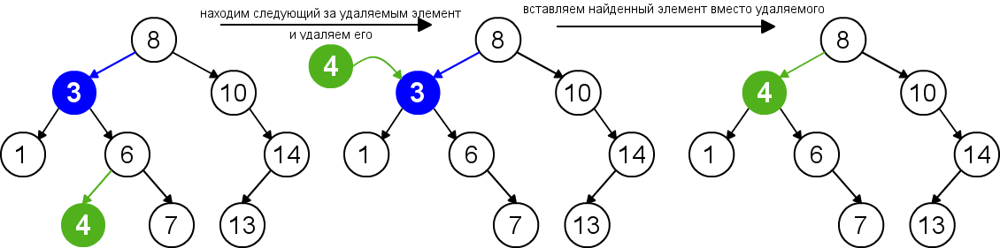

27/02/2026

https://metanit.com/

Граф - (G, V) G - вершины V - ребра

Табл связей (матрица смежности)

|     | V₁   | V₂   | …    | Vₙ   |
|-----|------|------|------|------|
| V₁  |      |      |      |      |
| V₂  |      |      |      |      |
| …   |      |      |      |      |
| Vₙ  |      |      |      |      |

A
| \               *         
|  C - дерево +  / \  - лес
| /
b

Деревья поика (слева меньше справа больше) = Binary reasearch tree
Сложность поиска O(log_2 N)

``` c
struct Node {
    Node *left;
    Node *right;
    int data;
}
```
Вставка

| Худший | Средний    | Лучший |
|--------|------------|--------|
| O(N)   | O(log₂ N)  | O(1)   |

!? почему в big O notation О(1) именно 1 берется за константу что иенно значит 1

Удаление 

1) No childs
    Просто удаляем
2) One child
    Замена на потомка
3) Two childs
    Замена на наим из наиб детей
    Замена на наиб из наим детей



Удаление

| Худший | Средний    | Лучший |
|--------|------------|--------|
| O(N)   | O(log₂ N)  | O(1)   |

Обход
1) Префикс 
2) Инфикс
3) Поствикс

Префикс
```
печатаем эл-т
идем влево
If no 
    возр на 1 вверх проверяем на право
```

Инфикс
```
идем влево
If no
    печатаем эл-т
    возр на 1 вверх проверяем на право
```

Постфикс
```
идем влево
If no
    возр на 1 вверх проверяем на право
    If no
        печатаем эл-т
```

TODO: пока нет точных критериев курсовой
